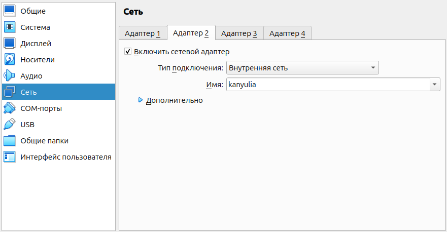
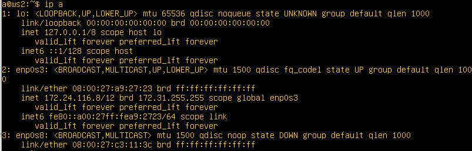
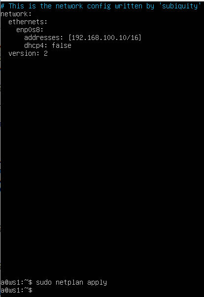
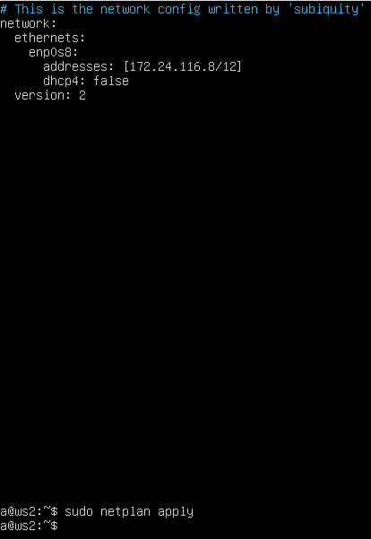
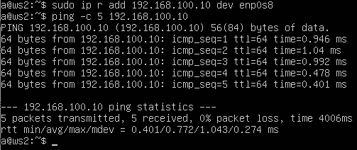

# Part 2. Static Routing Between Two Machines

> [English version](../ru/Part2_ru.md)

The examples in this section use the virtual machines `ws1` and `ws2`.

> [!NOTE]
> To establish a connection between the virtual machines, an additional VirtualBox internal network must be created.
>
> 1. Shut down the virtual machines.
> 2. Open **Settings → Network**.
> 3. Add an additional network adapter with the **Internal Network** attachment type.
> 4. Specify the same network name for both machines.
> 5. Start the virtual machines.



Check the list of network interfaces:

```bash
ip a
```

After adding the second adapter, an additional network interface will appear in the system.

**ws1**


**ws2**



---

Configure IP addresses using Netplan.

Configuration file:

```text
/etc/netplan/00-installer-config.yaml
```

Interface parameters:

| Machine | IP Address     | Mask |
| ------- | -------------- | ---- |
| ws1     | 192.168.100.10 | /16  |
| ws2     | 172.24.116.8   | /12  |

**ws1**



**ws2**



After modifying the configuration, apply the changes:

```bash
sudo netplan apply
```

---

### 2.1. Adding a Static Route Manually

Add routes between the machines using:

```bash
sudo ip route add <IP-address> dev enp0s8
```

where:

* `route` (`r`) — works with the routing table;
* `add` — adds a route;
* `dev` — specifies a network interface;
* `enp0s8` — the internal network interface.

On `ws1`:

```bash
sudo ip route add 172.24.116.8 dev enp0s8
ping -c 5 172.24.116.8
```


On `ws2`:

```bash
sudo ip route add 192.168.100.10 dev enp0s8
ping -c 5 192.168.100.10
```



Successful ICMP packet exchange confirms that a route exists between the machines.

---

### 2.2. Adding a Persistent Static Route

Reboot the virtual machines:

```bash
sudo reboot
```

To make the route persistent across reboots, add it to the Netplan configuration and apply the changes:

```bash
sudo netplan apply
```

`ws1` configuration:


`ws2` configuration:


Both configurations contain two interfaces:

* `enp0s3` — connection to the external network;
* `enp0s8` — internal network between the virtual machines.

Verify connectivity again.

On `ws1`:

```bash
ping -c 5 172.24.116.8
```


On `ws2`:

```bash
ping -c 5 192.168.100.10
```


The connection remains available after reboot because the route is configured through Netplan.

---

## Navigation

↑ [README](../../README.md)

← [Part 1. ipcalc Utility](Part1.md)

→ [Part 3. iperf3 Utility](Part3.md)

---
