## Part 5. Static Network Routing

> [Russian version](../ru/Part5_ru.md)

Virtual machines used in this section:

* `r1` and `r2` — routers;
* `ws11`, `ws21`, and `ws22` — workstations.

### 5.1. Network configuration

Configure network interfaces according to the network topology:


Before configuring the network, create internal VirtualBox networks and connect virtual machine adapters to them.

* `ws11`:

  1. **NAT** type for external connectivity.
  2. **Internal Network** for connection with `r1`. Name: `Network1`.

* `ws21` and `ws22`:

  1. **NAT** type for external connectivity.
  2. **Internal Network** for connection with `r2`. Name: `Network3`.

* `r1`:

  1. **NAT** type for external connectivity.
  2. **Internal Network** for connection with `ws11`. Name: `Network1`.
  3. **Internal Network** for connection with `r2`. Name: `Network2`.

* `r2`:

  1. **NAT** type for external connectivity.
  2. **Internal Network** for connection with `ws21` and `ws22`. Name: `Network3`.
  3. **Internal Network** for connection with `r1`. Name: `Network2`.

Configure network interfaces using Netplan:

* `ws11`:

  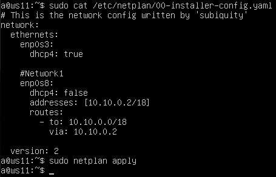

* `ws21`:

  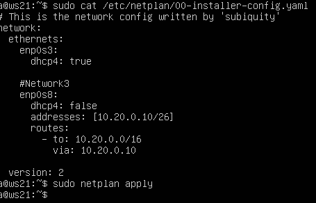

* `ws22`:

  

* `r1`:

  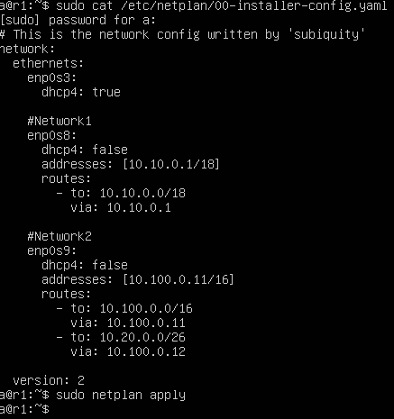

* `r2`:

  

Apply changes:

```bash
sudo netplan apply
```

Check IP configuration:

```bash
ip -4 a
```

* `ws11`:

  

* `ws21`:

  

* `ws22`:

  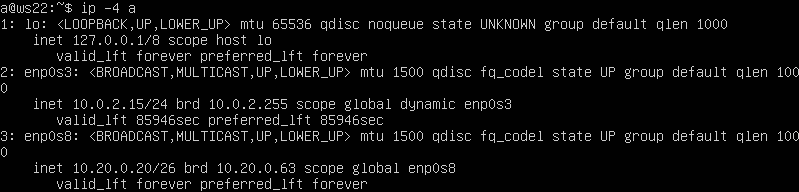

* `r1`:

  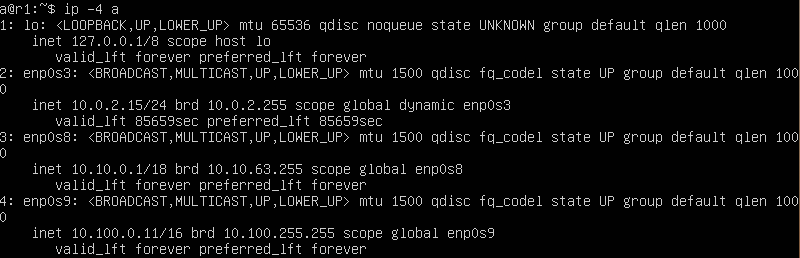

* `r2`:

  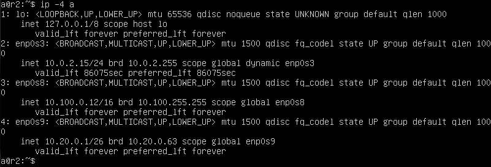

Check connectivity between nodes:

* `ws22 → ws21`:

  

* `r1 → ws11`:

  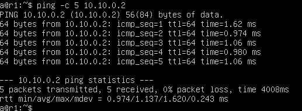

---

### 5.2. Enabling IP forwarding

Routers must forward packets between interfaces.

Temporarily enable forwarding:

```bash
sudo sysctl -w net.ipv4.ip_forward=1
```

* `r1`:

  

* `r2`:

  

To persist the setting after reboot, add it to `/etc/sysctl.conf`:

```text
net.ipv4.ip_forward = 1
```

* `r1`:

  

* `r2`:

  

---

### 5.3. Default route configuration

Configure default routes on workstations using Netplan.

Add the following route to `/etc/netplan/00-installer-config.yaml`:

```yaml
routes:
  - to: default
    via: <gateway IP>
```

* `ws11`:

  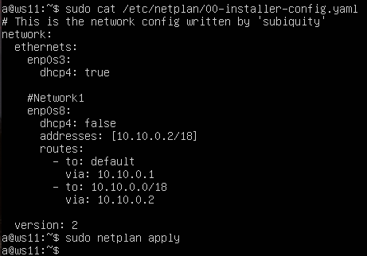

* `ws21`:

  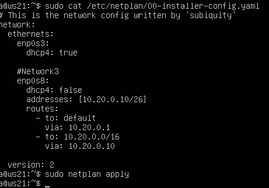

* `ws22`:

  

Apply changes:

```bash
sudo netplan apply
```

Check routing tables:

```bash
ip r
```

* `ws11`:

  

* `ws21`:

  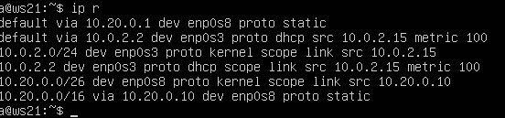

* `ws22`:

  

Check traffic flow through routers:

```bash
ping 10.100.0.12
```

where `10.100.0.12` is the address of `r2`.

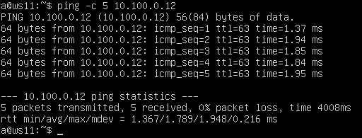

To capture and analyze traffic, use `tcpdump`.

On `r2`, start packet capture:

```bash
sudo tcpdump -tn -i enp0s9
```

After repeating the ping from `ws11`, packets appear in tcpdump output, confirming that traffic passes through the router.


---

### 5.4. Static routes

Static routes between networks are configured in Netplan on routers `r1` and `r2`.

* `r1`:

  

* `r2`:

  

Check routing tables:

```bash
ip r
```

* `r1`:

  

* `r2`:

  

Check the route selection for the network `10.10.0.0/18` and the default route:

```bash
ip r list 10.10.0.0/18
ip r list 0.0.0.0/0
```

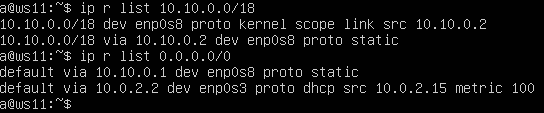

A more specific route is used for `10.10.0.0/18`. The default route is used only when no more specific match exists.

---

### 5.5. Router path tracing

On `r1`, start packet capture:

```bash
tcpdump -tnv -i enp0s8
```

At the same time, from `ws11`, send packets to `ws21`:

```bash
ping 10.20.0.10
```

  

  

Build the route from `ws11` to `ws21` using `traceroute`:

```bash
sudo traceroute 10.20.0.10
```

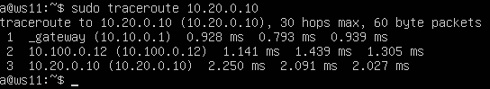

`Traceroute` works by increasing TTL: each router decreases TTL by 1 and returns ICMP "Time Exceeded" when TTL reaches zero.

---

### 5.6. ICMP in routing diagnostics

Start ICMP capture on `r1`:

```bash
tcpdump -n -i enp0s8 icmp
```

From `ws11`, send a packet to a non-existent address:

```bash
ping 10.30.0.111
```


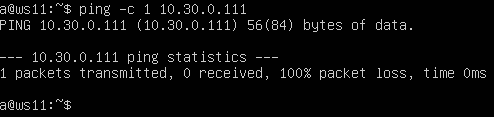

An ICMP "Destination Unreachable" message is returned, demonstrating ICMP usage for network diagnostics.

---

## Navigation

↑ [README](../../README.md)

← [Part 4. Firewall](Part4.md)

→ [Part 6. DHCP Dynamic IP Configuration](Part6.md)

---