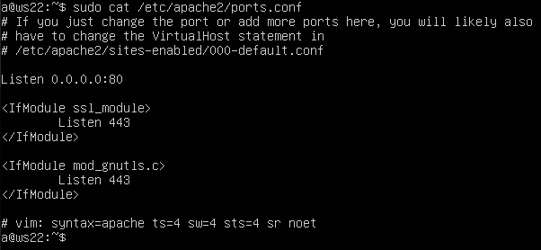
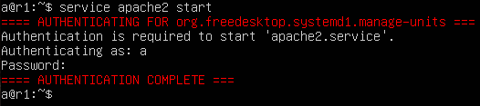
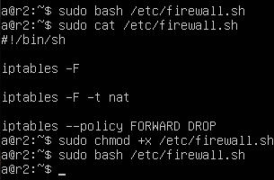
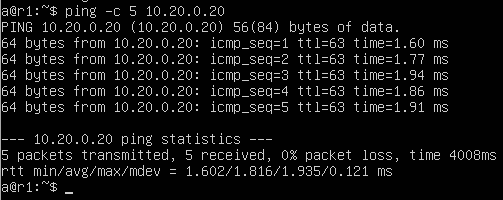
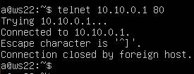
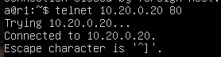

## Part 7. NAT

> [Russian version](../ru/Part7_ru.md)

`NAT` (Network Address Translation) modifies IP addresses and ports of packets as they pass through a router. Two variants are used: `SNAT` for outgoing connections and `DNAT` for redirecting incoming connections.

Virtual machines used in this section: `r1`, `r2`, and `ws22`.

`Apache` is a web server that handles HTTP requests and serves web pages over a network.

Install it on each machine:

```bash
sudo apt install apache2
```

---

### 7.1. Web server setup

On `ws22` and `r1`, edit `/etc/apache2/ports.conf` by replacing:

```text
Listen 80
```

with:

```text
Listen 0.0.0.0:80
```

`ws22`:



`r1`:


Start `Apache`:

```bash
sudo service apache2 start
```

`ws22`:


`r1`:



---

### 7.2. Basic traffic filtering

On `r2`, create `/etc/firewall.sh` and configure the following rules:

* clear `filter` table;
* clear `nat` table;
* set `FORWARD DROP` policy.

Run the script:

```bash
sudo chmod +x /etc/firewall.sh
sudo /etc/firewall.sh
```



Check connectivity between `ws22` and `r1`:


After disabling packet forwarding, communication between nodes is blocked.

---

### 7.3. Allowing ICMP

Add a rule that allows ICMP packet forwarding.


Restart the script and repeat the test:



After adding the rule, ICMP echo requests are again forwarded through `r2`.

---

### 7.4. SNAT and DNAT configuration

Add the following rules to `r2` configuration:

* SNAT for network `10.20.0.0`;
* DNAT for redirecting port `8080` traffic to the web server on `ws22`.


Test SNAT by connecting from `ws22` to the web server on `r1`:

```bash
telnet <r1-ip> 80
```



Test DNAT by connecting from `r1` to `r2` on port `8080`:

```bash
telnet <r2-ip> 8080
```



Connection is successfully redirected to the `ws22` web server.

---

## Navigation

↑ [README](../../README.md)

← [Part 6. DHCP Dynamic IP Configuration](Part6_ru.md)

→ [Part 8. SSH Tunnels](Part8_ru.md)

---