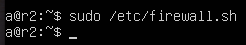
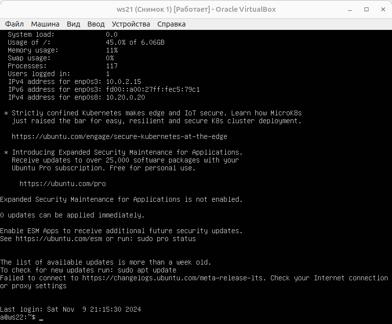
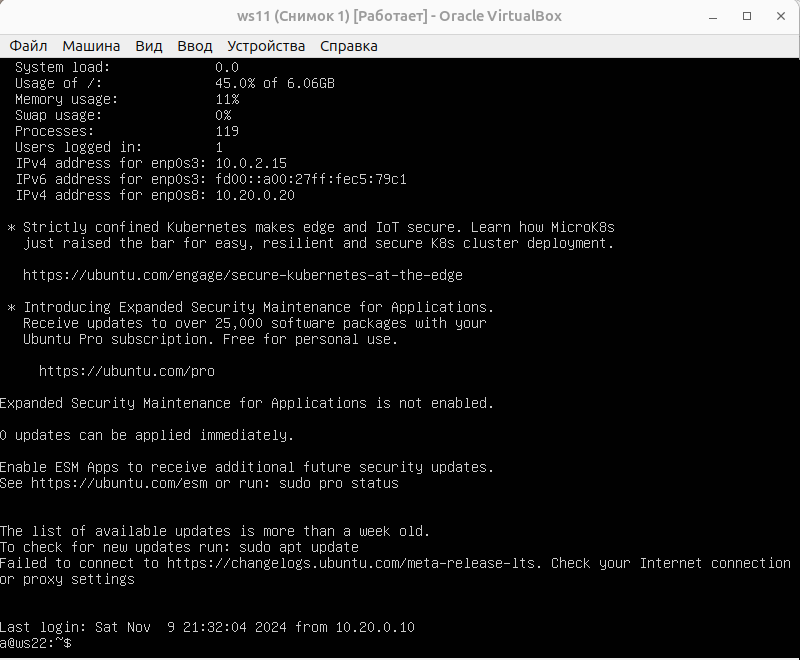

## Part 8. Introduction to SSH Tunnels

> [English version](../eng/Part8.md)

The following virtual machines are used for the examples: `r1`, `r2`, `ws11`, `ws21`, and `ws22`.

Start the firewall on `r2` using the rules from [Part 7](Part7.md).



Configure Apache on `ws22` to listen only on the local interface. To do this, in the file `/etc/apache2/ports.conf`, replace the line:

```text
Listen 80
```

with:

```text
Listen localhost:80
```

After modifying the configuration, restart the Apache service.


---

### 8.1. Local TCP Forwarding

To create a local SSH tunnel, use the following command:

```bash
ssh -L 8080:localhost:80 10.20.0.20
```

where:

* `-L` — creates a local TCP tunnel;
* `8080` — local port on the current machine;
* `localhost:80` — address and port of the web server on `ws22`;
* `10.20.0.20` — IP address of the `ws22` machine.

After establishing the connection, an SSH session to `ws22` is opened.



---

### 8.2. SSH tunnel between ws11 and ws22

Set up an SSH tunnel between `ws11` and `ws22`.

The result of the connection is shown in the screenshot below.



---

### 8.3. Tunnel verification

To verify access to the web server through the created tunnel, run:

```bash
telnet 127.0.0.1 8080
```

Check from `ws11`:


Check from `ws21`:


A successful connection to `127.0.0.1:8080` confirms that the request was forwarded through the SSH tunnel to the Apache web server running on `ws22`.

---

## Navigation

↑ [README](../../README.md)

← [Part 7. NAT](Part7.md)

---