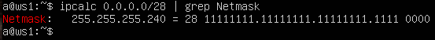
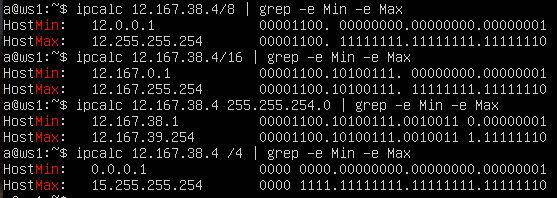
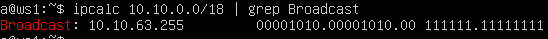

## Part 1. Инструмент ipcalc

Для выполнения примеров используется виртуальная машина `ws1`.

### 1.1. Сети и маски

#### 1. Определение адреса сети

Для вычисления адреса сети используется утилита `ipcalc`.

Выполним команду:

```bash
ipcalc 192.167.38.54/13 | grep Network
```

Результат:

```text
Network:   192.160.0.0/13
```

Следовательно, адрес сети для узла 192.167.38.54/13 - это 192.160.0.0.


#### 2. Преобразование масок подсети

- Преобразуем маску `/15`:

  ```bash
  ipcalc 0.0.0.0/15 | grep Netmask
  ```

  Вывод:

  ```text
  Netmask:  255.254.0.0 = 15   11111111.11111110.00000000.00000000
  ```

  

  - Обычная запись: 255.254.0.0

  - Двоичная запись: 11111111.11111110.00000000.00000000


- Преобразуем маску `11111111.11111111.11111111.11110000`:

  ```bash
  ipcalc 11111111.11111111.11111111.11110000 | grep Netmask
  ```

  Вывод:

  ```text
  Netmask:  255.255.255.240 = 28   11111111.11111111.11111111.11110000
  ```

  

  - Обычная запись: 255.255.255.240

  - Префиксная запись: /28


- Преобразуем маску `255.255.255.0`:

  ```bash
  ipcalc 255.255.255.0 | grep -e Address -e Netmask
  ```

  Вывод:

  ```text
  Address:  255.255.255.0        11111111.11111111.11111111.00000000
  Netmask:  255.255.255.0 = 24   11111111.11111111.11111111.00000000
  ```

  

  - Префиксная запись: `/24`

  - Двоичная запись: `11111111.11111111.11111111.00000000`

#### 3. Минимальный и максимальный адрес хоста

Определим минимальный и максимальный адрес хоста для узла `12.167.38.4` при различных масках подсети.

Определим диапазон адресов:

```bash
ipcalc <IP-адрес>/<маска> | grep -e Min -e Max
```

- Для маски `/8`:

  ```bash
  ipcalc 12.167.38.4/8 | grep -e Min -e Max
  ```

  ```text
  HostMin:   12.0.0.1
  HostMax:   12.255.255.254
  ```

- Для маски `11111111.11111111.00000000.00000000` (`/16`):

  ```bash
  ipcalc 12.167.38.4/16 | grep -e Min -e Max
  ```

  ```text
  HostMin:   12.167.0.1
  HostMax:   12.167.255.254
  ```

- Для маски `255.255.254.0` (`/23`):

  ```bash
  ipcalc 12.167.38.4/23 | grep -e HostMin -e HostMax
  ```

  ```text
  HostMin:   12.167.38.1
  HostMax:   12.167.39.254
  ```

- Для маски `/4`:

  ```bash
  ipcalc 12.167.38.4/4 | grep -e HostMin -e HostMax
  ```

  ```text
  HostMin:   0.0.0.1
  HostMax:   15.255.255.254
  ```

  

---

### 1.2. localhost

Адреса диапазона `127.0.0.0/8` зарезервированы для loopback-интерфейса (`localhost`).

Проверим, с каких IP-адресов возможен доступ к приложению на `localhost`:

| IP-адрес        | Доступ к localhost |
| --------------- | ------------------ |
| `194.34.23.100` | Нет                |
| `127.0.0.2`     | Да                 |
| `127.1.0.1`     | Да                 |
| `128.0.0.1`     | Нет                |

Доступ к `localhost` возможен только с адресов диапазона `127.0.0.0/8`.

---

### 1.3. Диапазоны и сегменты сетей

#### 1. Публичные и частные IP-адреса

Частные IP-адреса используются внутри локальных сетей и не маршрутизируются в интернет.

Диапазоны частных адресов:

* `10.0.0.0/8`
* `172.16.0.0/12`
* `192.168.0.0/16`

Определим, какие из указанных адресов какие адреса относятся к частным, а какие к публичным.

Примеры команд:

- Команда:

    ```bash
    ipcalc 10.0.0.45 | grep Hosts
    ```
    Результат:

    ```text
    Hosts/Net: 254      Class A, Private Internet
    ```

    Это частный IP-адрес.

- Команда:

    ```bash
    ipcalc 134.43.0.2 | grep Hosts
    ```

    Результат:

    ```text
    Hosts/Net: 254      Class B
    ```

    Это публичный IP-адрес.


| Частные IP-адреса | Публичные IP-адреса |
| ----------------- | ------------------- |
| `10.0.0.45`       | `134.43.0.2`        |
| `192.168.4.2`     | `172.0.2.1`         |
| `172.20.250.4`    | `192.172.0.1`       |
| `172.16.255.255`  | `172.68.0.2`        |
| `10.10.10.10`     | `192.169.168.1`     |


#### 2. Возможные IP-адреса шлюза для сети

Определим диапазон адресов сети `10.10.0.0/18`:

```bash
ipcalc 10.10.0.0/18 | grep Broadcast
```

Вывод:

```text
Broadcast: 10.10.63.255     00001010.00001010.00 111111.11111111
```



Допустимые адреса хостов находятся в диапазоне:

* от `10.10.0.1`
* до `10.10.63.254`

Следовательно, в качестве адреса шлюза могут использоваться:

* `10.10.0.2`
* `10.10.10.10`
* `10.10.1.255`

Не могут использоваться:

* `10.0.0.1`
* `10.10.100.1`