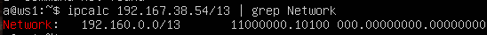
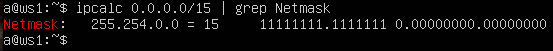
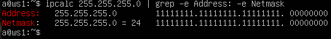
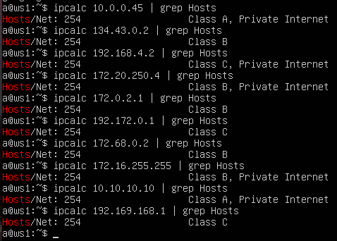

## Part 1. Инструмент ipcalc

> [English version](../eng/Part1.md)

Для выполнения примеров используется виртуальная машина `ws1`.

### 1.1. Сети и маски

#### 1. Определение адреса сети

Адрес сети определяется с помощью `ipcalc`:

```bash
ipcalc 192.167.38.54/13 | grep Network
```

Результат:

```text
Network:   192.160.0.0/13
```

Следовательно, сеть — `192.160.0.0`.



#### 2. Преобразование масок подсети

Маски подсети преобразуются с помощью `ipcalc`:

```bash
ipcalc <маска> | grep Netmask
```

- Маска `/15`:

  - Обычная запись: 255.254.0.0

  - Двоичная запись: 11111111.11111110.00000000.00000000

  

- Маска `255.255.255.0`:

  - Префиксная запись: `/24`

  - Двоичная запись: `11111111.11111111.11111111.00000000`

  

#### 3. Минимальный и максимальный адрес хоста

Определим минимальный и максимальный адрес хоста для узла `12.167.38.4` при различных масках подсети:

```bash
ipcalc <IP-адрес>/<маска> | grep -e Min -e Max
```

| Маска | Минимальный адрес | Максимальный адрес |
|---------|---------|---------|
| `/8` | `12.0.0.1` | `12.255.255.254` |
| `/16` | `12.167.0.1` | `12.167.255.254` |
| `/23` | `12.167.38.1` | `12.167.39.254` |
| `/4` | `0.0.0.1` | `15.255.255.254` |


---

### 1.2. localhost

Адреса диапазона `127.0.0.0/8` зарезервированы для loopback-интерфейса (`localhost`).

Доступ к localhost возможен только с адресов диапазона `127.0.0.0/8`.

| IP-адрес        | Доступ к localhost |
| --------------- | ------------------ |
| `194.34.23.100` | Нет                |
| `127.0.0.2`     | Да                 |
| `127.1.0.1`     | Да                 |
| `128.0.0.1`     | Нет                |

---

### 1.3. Диапазоны и сегменты сетей

#### 1. Публичные и частные IP-адреса

Определим, какие из указанных адресов какие адреса относятся к частным, а какие к публичным, с помощью команды:

```bash
ipcalc <IP-адрес> | grep Hosts
```

`ipcalc` показывает, относится ли адрес к `private network`.

Классификация IP-адресов:

| Частные IP-адреса | Публичные IP-адреса |
| ----------------- | ------------------- |
| `10.0.0.45`       | `134.43.0.2`        |
| `192.168.4.2`     | `172.0.2.1`         |
| `172.20.250.4`    | `192.172.0.1`       |
| `172.16.255.255`  | `172.68.0.2`        |
| `10.10.10.10`     | `192.169.168.1`     |



#### 2. Возможные IP-адреса шлюза для сети

Определим диапазон адресов сети `10.10.0.0/18`:

```bash
ipcalc 10.10.0.0/18 | grep Broadcast
```

Вывод:

```text
Broadcast: 10.10.63.255     00001010.00001010.00 111111.11111111
```


Допустимые адреса хостов находятся в диапазоне:

* от `10.10.0.1`
* до `10.10.63.254`

Следовательно, в качестве адреса шлюза могут использоваться:

* `10.10.0.2`
* `10.10.10.10`
* `10.10.1.255`

Не могут использоваться:

* `10.0.0.1`
* `10.10.100.1`

---

## Навигация

↑ [README_ru](../../README_ru.md)

→ [Part 2. Статическая маршрутизация между двумя машинами](Part2_ru.md)

---