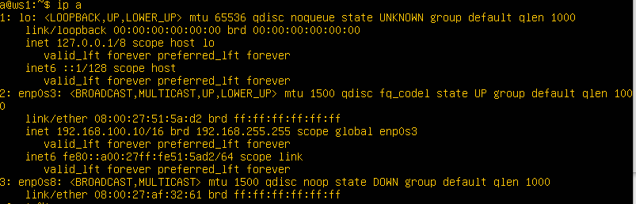
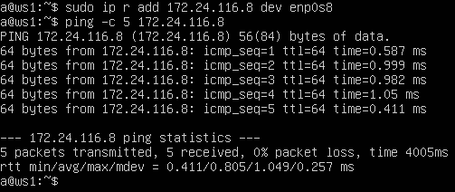
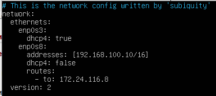
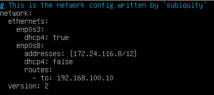
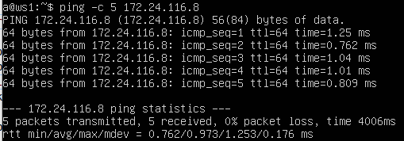
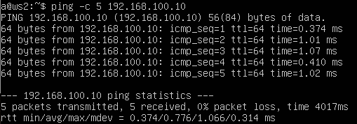

## Навигация

↑ [README_ru](../README_ru.md)

← [Part 1. Инструмент ipcalc](../docs/Part1.md)

→ [Part 3. Утилита iperf3](../docs/Part3.md)

## Part 2. Статическая маршрутизация между двумя машинами

Для этого задания поднимаем вторую виртуальную машину под именем ws2.

> **!Неочевидная фигня!**
> 
> Чтобы всё работало, нужно дополнительно настроить машины в VirtualBox.
> 1. Выключаем машины;
> 2. Открываем у каждой машины меню `Настроить -> Сеть`;
> 3. Добавляем новый сетевой адаптер с типом подключения `Внутренняя сеть` и даём этой сети название (важно, чтобы название было одинаковым, у нас это `канюля`, потому что слово смешное).
> 
> 
>
> 4. Машины можно снова запускать.
>
> **!Конец неочевидной фигни!**

---

1. С помощью команды `ip a` посмотрим существующие сетевые интерфейсы (Их три, а не два, потому что мы добавили ещё один сетевой адаптер).

    - **ws1**:

    - **ws2**:

2. Откроем файл конфигурации Netplan (*/etc/netplan/00-installer-config.yaml*) на каждой машине и изменим адреса согласно требованиям, после чего выполним команду `netplan apply` для перезапуска сервиса сети.

    - **ws1**: 192.168.100.10, маска /16
  
      

    - **ws2**: 172.24.116.8, маска /12
  
      

---

### 2.1. Добавление статического маршрута вручную

>**Статический маршрут** — это конкретный маршрут, который вручную добавляется в таблицу маршрутизации на маршрутизаторе или компьютере. Он указывает путь к сети через конкретный шлюз (маршрутизатор). В отличие от динамических маршрутов, которые автоматически обновляются на основе протоколов маршрутизации, статические маршруты остаются неизменными, пока их не изменит администратор.

---

1. Добавим статический маршрут от одной машины до другой и обратно при помощи команды `ip r add <IP-адрес, к которому будет добавлен маршрут> dev enp0s8`, где:

    - **r:** Сокращение от route, указывает, что команда будет работать с маршрутами;
    - **add:** Указывает, что мы добавляем новый маршрут;
    - **dev:** Сокращение от "device" (устройство), указывает, что следующий аргумент будет именем сетевого интерфейса;
    - **enp0s8:** Имя сетевого интерфейса, через который будет проходить маршрут (внутренняя сеть).

2. Пропингуем соединение между машинами.
  
    - **ws1**: `sudo ip r add 172.24.116.8 dev enp0s8`; `ping -с 5 172.24.116.8`

    - **ws2**: `sudo ip r add 192.168.100.10 dev enp0s8`; `ping -с 5 192.168.100.10`

---

### 2.2. Добавление статического маршрута с сохранением

1. Перезапустим машины (`reboot`).

2. Добавим статический маршрут от одной машины до другой с помощью файла */etc/netplan/00-installer-config.yaml* и перезапустим сервис сети командой `netplan apply` (Добавили сеть enp0s3 для соединения с внешней сетью).

    - **ws1**:

      

    - **ws2**:

      

3. Снова пропингуем соединение между машинами.

    - **ws1**: `ping -с 5 172.24.116.8`

      

    - **ws2**: `ping -с 5 192.168.100.10`

      

---