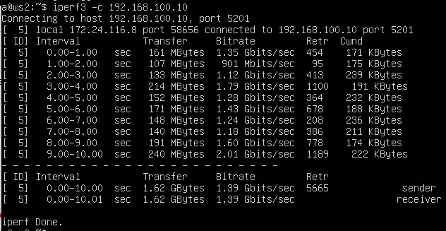

## Навигация

↑ [README_ru](../README_ru.md)

← [Part 2. Статическая маршрутизация между двумя машинами](../docs/Part2.md)

→ [Part 4. Сетевой экран](../docs/Part4.md)

## Part 3. Утилита iperf3

>**iperf3** — это инструмент для измерения пропускной способности сети. Он используется для тестирования сетевой производительности между двумя хостами. iperf3 может измерять как TCP, так и UDP пропускную способность, а также поддерживает опции для настройки параметров тестирования, таких как размер буфера, количество потоков и другие.

Используем виртуальные машины ws1 и ws2 из Части 2.

### 3.1. Скорость соединения

- **8 Mbps в MB/s:**

  1 Mbps (Мегабит в секунду) = 0.125 MB/s (Мегабайт в секунду).

  8 Mbps = 8 * 0.125 = 1 MB/s.

- **100 MB/s в Kbps:**

  1 MB/s (Мегабайт в секунду) = 8 Mbps (Мегабит в секунду).

  1 Mbps = 1000 Kbps.

  100 MB/s = 100 * 8 * 1000 = 800,000 Kbps.

- **1 Gbps в Mbps:**

  1 Gbps (Гигабит в секунду) = 1000 Mbps (Мегабит в секунду).

---

### 3.2. Утилита iperf3

Измерим скорость соединения между ws1 и ws2 с помощью утилиты iperf3, предварительно установив её.

1. Запуск iperf3-сервера:

На одной из машин (ws1) используем команду `iperf3 -s`. Это запустит iperf3 в режиме сервера, который будет слушать входящие соединения на порту 5201 (по умолчанию).

2. Запуск iperf3-клиента:

На другой машине (ws2), подключимся к серверу и измерим скорость соединения с помощью команды `iperf3 -c <IP-адрес ws1>`.

- **Transfer** — объем переданных данных.
- **Bandwidth** — средняя пропускная способность за время теста.
- **Retr** — количество повторных передач (для TCP-тестов).
- **Cwnd** — размер TCP-окна (для TCP-тестов).

Таким образом, мы видим, что скорость соединения между нашими машинами — 1.39 Gbits/sec (гигабит в секунду).

---

