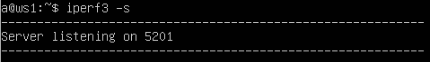

## Part 3. Утилита `iperf3`

> [English version](../eng/Part3.md)

Для выполнения примеров используются виртуальные машины `ws1` и `ws2`.

`iperf3` используется для измерения пропускной способности сетевого соединения.

Установим `iperf3` на обе виртуальные машины.

```bash
sudo apt install iperf3
```

На `ws1` запустим сервер:

```bash
iperf3 -s
```

Сервер по умолчанию начинает прослушивать TCP-порт `5201`.



На `ws2` запустим клиент и подключимся к серверу:

```bash
iperf3 -c 192.168.100.10
```

где `192.168.100.10` — IP-адрес машины `ws1`.


Основные поля вывода:

| Поле      | Описание                                 |
| --------- | ---------------------------------------- |
| Transfer  | Объём переданных данных                  |
| Bandwidth | Средняя пропускная способность           |
| Retr      | Количество повторных передач TCP-пакетов |
| Cwnd      | Размер TCP congestion window             |

По результатам тестирования средняя пропускная способность составила **1.39 Gbit/s**.

---

## Навигация

↑ [README_ru](../../README_ru.md)

← [Part 2. Статическая маршрутизация между двумя машинами](Part2_ru.md)

→ [Part 4. Сетевой экран](Part4_ru.md)

---