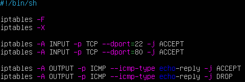
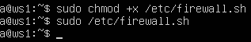

## Part 4. Сетевой экран

> [English version](../eng/Part4.md)

Для выполнения примеров используются виртуальные машины `ws1` и `ws2`.

### 4.1. Утилита iptables

`iptables` используется для настройки правил фильтрации сетевого трафика в Linux.

Чтобы создать фаервол на обеих машинах, создадим на каждой файл */etc/firewall.sh* и настроим так:

- Для `ws1`:

  

- Для `ws2`:

  

**Объяснение скриптов:**

1. `iptables -F` — очистка существующих правил.

2. `iptables -X` — удаление пользовательских цепочек.

3. `iptables -A INPUT -p TCP --dport=22 -j ACCEPT` — разрешение входящих SSH-подключений (порт 22).

4. `iptables -A INPUT -p TCP --dport=80 -j ACCEPT` — разрешение входящих HTTP-подключений (порт 80).

5. `iptables -A OUTPUT -p ICMP --icmp-type echo-reply -j DROP` — запрет отправки ICMP echo-reply.

6. `iptables -A OUTPUT -p ICMP --icmp-type echo-reply -j ACCEPT` — разрешение отправки ICMP echo-reply.

Сделаем скрипт исполняемым и запустим его на обеих машинах:

```bash
sudo chmod +x /etc/firewall.sh
sudo /etc/firewall.sh
```

 

**Различия конфигураций:**

На `ws1` отправка ICMP echo-reply запрещена, поэтому машина не будет отвечать на ping-запросы.

На `ws2` отправка ICMP echo-reply разрешена, поэтому машина будет отвечать на ping-запросы.

---

### 4.2. Утилита nmap

Для проверки доступности узла используется `nmap`.

На `ws2` ответы на ICMP-запросы разрешены:


На `ws1` ответы на ICMP-запросы заблокированы:


Несмотря на отсутствие ответа на ping, сканирование через `nmap` показывает, что узел `ws1` доступен.


---

## Навигация

↑ [README_ru](../../README_ru.md)

← [Part 3. Утилита iperf3](Part3_ru.md)

→ [Part 5. Статическая маршрутизация сети](Part5_ru.md)