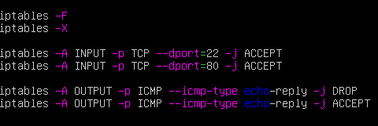
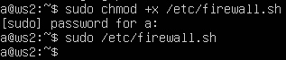
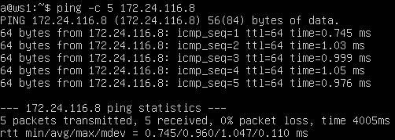
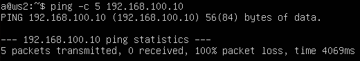
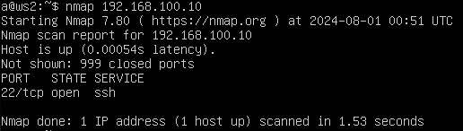

## Навигация

↑ [README_ru](../README_ru.md)

← [Part 3. Утилита iperf3](../docs/Part3.md)

→ [Part 5. Статическая маршрутизация сети](../docs/Part5.md)

## Part 4. Сетевой экран

### 4.1. Утилита iptables

> **Фаервол** (англ. firewall) — это сетевое устройство или программное обеспечение, которое контролирует входящий и исходящий сетевой трафик на основе определенных правил безопасности. Основная цель фаервола — предотвратить несанкционированный доступ к или из частной сети.

> **iptables** — это утилита командной строки, которая позволяет администратору управлять правилами фильтрации сетевых пакетов на уровне ядра в Linux. Это инструмент для настройки и управления таблицами IP-фильтров.
>
> Основные команды iptables:
> - **iptables -A**: Добавить новое правило в конец цепочки.
> - **iptables -I**: Вставить новое правило в указанную позицию в цепочке.
> - **iptables -D**: Удалить правило из цепочки.
> - **iptables -F**: Очистить все правила в цепочке.
> - **iptables -P**: Установить политику по умолчанию для цепочки (например, DROP или ACCEPT).
> - **iptables -L**: Просмотреть правила в цепочке.
---

Чтобы создать фаервол на обеих машинах, создаём на каждой файл */etc/firewall.sh* и настроим так:

- Для ws1 — стратегия, когда в начале пишется запрещающее правило, а в конце — разрешающее:

- Для ws2 — стратегия, когда в начале пишется разрешающее правило, а в конце  — запрещающее:

**Объяснение скриптов:**

1. **iptables -F**:

Очищает все правила в текущих таблицах, удаляя все правила во всех цепочках (INPUT, OUTPUT и FORWARD).

2. **iptables -X**:

Удаляет все пользовательские цепочки. Если они пустые, то они будут удалены.

3. **iptables -A INPUT -p TCP --dport=22 -j ACCEPT**:

Добавляет правило в конец цепочки INPUT, которое разрешает все входящие TCP-пакеты, адресованные порту 22 (используется для SSH). Это означает, что машина будет принимать соединения по SSH.

4. **iptables -A INPUT -p TCP --dport=80 -j ACCEPT**:

Добавляет правило в конец цепочки INPUT, которое разрешает все входящие TCP-пакеты, адресованные порту 80 (используется для HTTP). Это означает, что машина будет принимать HTTP-соединения.

5. **iptables -A OUTPUT -p ICMP --icmp-type echo-reply -j DROP**:

Добавляет правило в конец цепочки OUTPUT, которое запрещает все исходящие ICMP-пакеты типа echo-reply. Это запрещает машине отправлять ответы на пинги (ICMP-ответы).

6. **iptables -A OUTPUT -p ICMP --icmp-type echo-reply -j ACCEPT**:

Добавляет правило в конец цепочки OUTPUT, которое разрешает все исходящие ICMP-пакеты типа echo-reply. Это разрешает машине отправлять ответы на пинги (ICMP-ответы).

---

Теперь добавим разрешение на выполнение (execute) для файла */etc/firewall.sh*, делая его исполняемым с помощью команды `sudo chmod +x /etc/firewall.sh`, после чего его можно будет запустить.

---

**Разница стратегий:**

- **ws1:**

Запрещающее правило по умолчанию применяются вначале, и если для конкретного трафика есть соответствующее разрешающее правило, оно будет добавлено позже, переопределяя запрещающее.

- **ws2:**

Разрешающие правила применяются вначале, и если для конкретного трафика есть соответствующее запрещающее правило, оно будет добавлено позже, переопределяя разрешающее.

---

### 4.2. Утилита nmap

> **Nmap** (Network Mapper) — это утилита для сканирования и анализа сетей, позволяющая получить информацию о сетевых устройствах и службам, обнаруживать открытые порты, идентифицировать активные узлы и находить уязвимости.
---

Пропингуем оба устройства:

- **ws2** — пингуется.

  

- **ws1** — не пингуется.

  

Установив nmap, используем эту утилиту, чтобы проверить, запущен ли хост ws1:

Как видим, хост запущен.

---

Теперь сохраним дампы машин ws1 и ws2, но это уже останется в тени.

---

