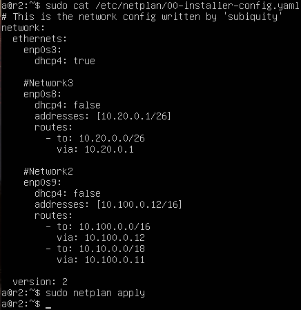
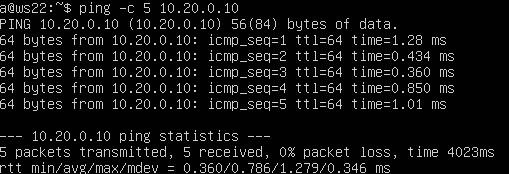
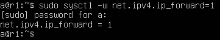
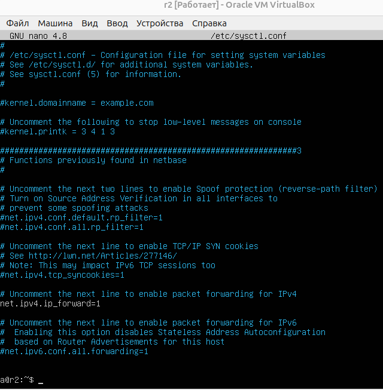
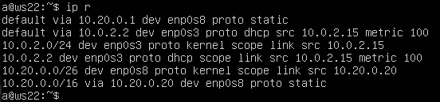
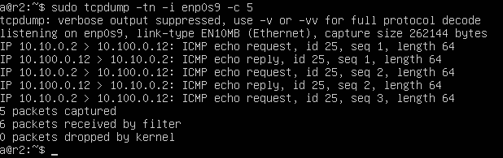
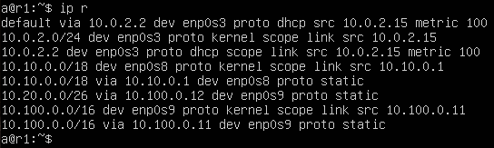
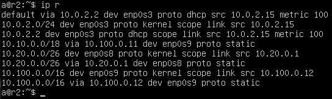
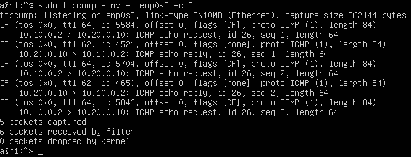
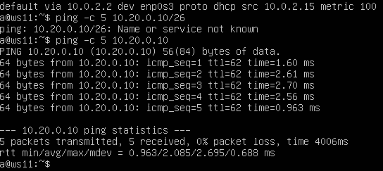

## Part 5. Статическая маршрутизация сети

> [English version](../eng/Part5.md)

Для выполнения примеров используются виртуальные машины:
- `r1` и `r2` — маршрутизаторы;
- `ws11`, `ws21` и `ws22` — рабочие станции.

### 5.1. Настройка адресов машин

Настроим сетевые интерфейсы в соответствии со схемой сети:

  

Перед настройкой сети необходимо создать внутренние сети VirtualBox и подключить к ним сетевые адаптеры виртуальных машин.

- `ws11`:
  1. Тип **NAT** для подключения к внешней сети.
  2. Тип **Внутренняя сеть** для подключения к сети с `r1`. Название: `Network1`.
   
- `ws21` и `ws22`:
  1. Тип **NAT** для подключения к внешней сети.
  2. Тип **Внутренняя сеть** для подключения к сети с `r2`. Название: `Network3`.

- `r1`:
  1. Тип **NAT** для подключения к внешней сети.
  2. Тип **Внутренняя сеть** для подключения к сети с `ws11`. Название: `Network1`.
  3. Тип **Внутренняя сеть** для связи с `r2`. Название: `Network2`.
   
- `r2`:
  1. Тип **NAT** для подключения к внешней сети.
  2. Тип **Внутренняя сеть** для подключения к сети с `ws21` и `ws22`. Название: `Network3`.
  3. Тип **Внутренняя сеть** для связи с `r1`. Название: `Network2`.

Настроим сетевые интерфейсы через Netplan:

- `ws11`:

  

- `ws21`:

  

- `ws22`:

  

- `r1`:

  

- `r2`:

  

Применим изменения:

```bash
sudo netplan apply
```

Проверим корректность настройки адресов:

```bash
ip -4 a
```

- `ws11`:

  

- `ws21`:

  

- `ws22`:

  

- `r1`:

  

- `r2`:

  

Проверим сетевую связность между узлами:

- `ws22 → ws21`:
  
  

- `r1 → ws11`:
  
  
  

---

### 5.2. Включение переадресации IP-адресов

На маршрутизаторах необходимо включить пересылку пакетов между сетевыми интерфейсами.

Для временного включения используем команду:

```bash
sudo sysctl -w net.ipv4.ip_forward=1
```
- `r1`:

  

- `r2`:
  
  

Для сохранения настройки после перезагрузки добавим параметр в файл `/etc/sysctl.conf`:

```text
net.ipv4.ip_forward = 1
```

- **r1**:

  

- **r2**:
  
  

---

### 5.3. Установка маршрута по умолчанию

Настроим маршрут по умолчанию на рабочих станциях через Netplan.

В файле `/etc/netplan/00-installer-config.yaml` добавим маршрут:

```yaml
routes:
  - to: default
    via: <IP-адрес шлюза>
```

- `ws11`:

  

- `ws21`:
  
  

- `ws22`:
  
  

Применим изменения:

```bash
sudo netplan apply
```

Проверим таблицы маршрутизации:

```bash
ip r
```

- `ws11`:

  

- `ws21`:
  
  

- `ws22`:
  
  

Проверим прохождение трафика через маршрутизаторы:

```bash
ping 10.100.0.12
```

где 10.100.0.12 — адрес интерфейса `r2`.


Для захвата и анализа сетевого трафика можно использовать `tcpdump`.

На `r2` запустим захват трафика:

```bash
sudo tcpdump -tn -i enp0s9
```

После повторного запуска `ping` на `ws11` пакеты отображаются в выводе `tcpdump`, что подтверждает прохождение трафика через маршрутизатор.



### 5.4. Добавление статических маршрутов

Статические маршруты между сетями настроены в конфигурации Netplan на маршрутизаторах `r1` и `r2`.

- `r1`:

  

- `r2`:

  

Проверим таблицы маршрутизации на обоих роутерах:

```bash
ip r
```

- `r1`:

  

- `r2`:

  


Проверим выбор маршрута для сети `10.10.0.0/18` и маршрута по умолчанию:

```bash
ip r list 10.10.0.0/18
ip r list 0.0.0.0/0
```

  

Для сети `10.10.0.0/18` используется более специфичный маршрут. Маршрут по умолчанию применяется только в том случае, если для назначения отсутствует более точное правило маршрутизации.

---

### 5.5. Построение списка маршрутизаторов

На `r1` запустим захват трафика:

```bash
tcpdump -tnv -i enp0s8
```

Параллельно с `ws11` отправим пакеты на `ws21`:

```bash
ping 10.20.0.10
```

  

  

Построим маршрут от `ws11` до `ws21` с помощью `traceroute`:

```bash
sudo traceroute 10.20.0.10
```


`Traceroute` определяет маршрут за счёт увеличения TTL: каждый маршрутизатор уменьшает TTL на 1 и при его обнулении возвращает ICMP `Time Exceeded`.

---

### 5.6. Использование протокола ICMP при маршрутизации

На `r1` запустим перехват ICMP-трафика:

```bash
tcpdump -n -i enp0s8 icmp
```

Одновременно с `ws11` отправим пакет на несуществующий адрес:

```bash
ping 10.30.0.111
```


В ответ возвращается ICMP-сообщение об ошибке маршрутизации (Destination Unreachable), что демонстрирует использование ICMP для диагностики сетевых проблем.

---

## Навигация

↑ [README_ru](../../README_ru.md)

← [Part 4. Сетевой экран](Part4_ru.md)

→ [Part 6. Динамическая настройка IP с помощью DHCP](Part6_ru.md)

---