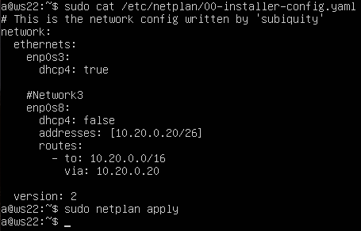
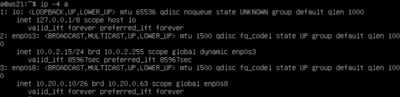
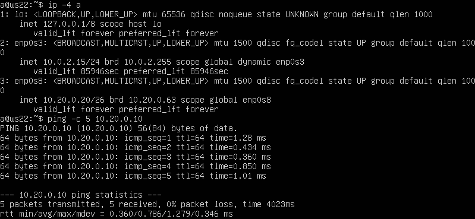
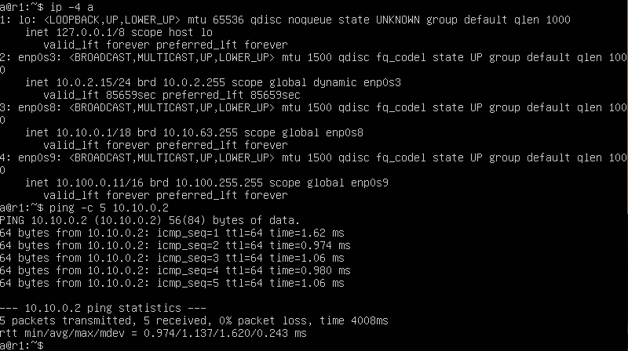
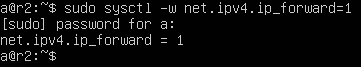
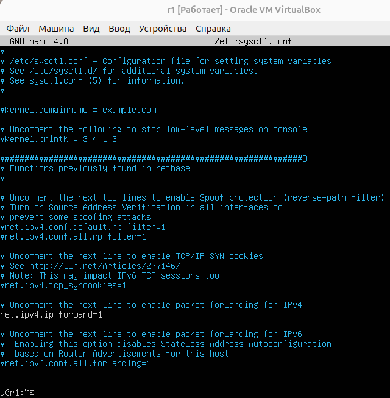
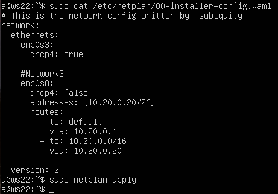
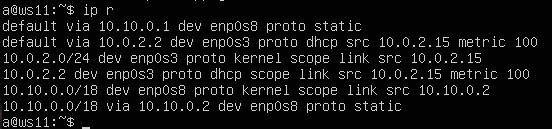
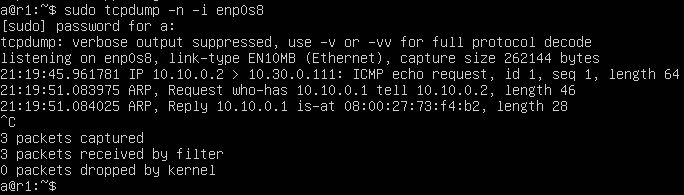

## Навигация

↑ [README_ru](../README_ru.md)

← [Part 4. Сетевой экран](../docs/Part4.md)

→ [Part 6. Динамическая настройка IP с помощью DHCP](../docs/Part6.md)

## Part 5. Статическая маршрутизация сети

Поднимаем пять виртуальных машин: 2 роутера (r1 и r2) и 3 рабочие станции (ws11, ws21 и ws22).

> **Роутер**, он же **маршрутизатор**, — это устройство, которое пересылает пакеты данных между компьютерными сетями. Роутер управляет трафиком, направляя пакеты данных к их конечным пунктам назначения через различные сети. Он работает на сетевом уровне модели OSI (уровень 3) и использует IP-адреса для определения пути передачи данных.
> 
> **Функции роутера**:
>
> - **Маршрутизация трафика**: Определение оптимального пути для передачи пакетов данных между сетями.
> - **Переадресация данных**: Пересылка пакетов данных между устройствами в локальной сети (LAN) и глобальной сети (WAN), такой как интернет.
> - **Подключение сетей**: Связь между различными сетями, такими как домашняя сеть и интернет, корпоративная сеть и удаленные офисы и т.д.
> - **Безопасность**: Обеспечение базовой защиты сети за счет функций брандмауэра и NAT (Network Address Translation).

---

### 5.1. Настройка адресов машин

1. Настроим конфигурации машин согласно сети на рисунке ниже и сразу же перезапустим сервис сети для каждой машины с помощью команды `sudo netplan apply`.

Не забудем прежде всего настроить сетевые адаптеры для каждой машины (в настройках VirtualBox):

- **ws11**:
  1. Тип NAT для подключения к внешней сети.
  2. Тип Внутренняя сеть для подключения к сети, предоставленной r1. Название: Network1.
   
- **ws21** и **ws22**:
  1. Тип NAT для подключения к внешней сети.
  2. Тип Внутренняя сеть для подключения к сети, предоставленной r2. Название: Network3.

- **r1**:
  1. Тип NAT для подключения к внешней сети.
  2. Тип Внутренняя сеть для подключения к сети с ws11. Название: Network1.
  3. Тип Внутренняя сеть для связи с r2. Название: Network2.
   
- **r2**:
  1. Тип NAT для подключения к внешней сети.
  2. Тип Внутренняя сеть для подключения к сети с ws21 и ws22. Название: Network3.
  3. Тип Внутренняя сеть для связи с r1. Название: Network2.

---

**! Заранее устанавливаем traceroute, т.к. эта утилита потребуется нам в одном из заданий**

Содержание файла *etc/netplan/00-installer-config.yaml* на каждой машине:

- **ws11**:

  

- **ws21**:

  

- **ws22**:

  

- **r1**:

  

- **r2**:

  

---

2. Проверим, что адреса заданы верно с помощью `ip -4 a`, после чего пропингуем ws22 с ws21 и r1 с ws11.

- **ws11**:

  

- **ws21**:

  

- **ws22**:

  

- **r1**:

  

- **r2**:

  

---

### 5.2. Включение переадресации IP-адресов

> **Переадресация IP-адресов** (IP Forwarding) — это процесс пересылки пакетов с одного сетевого интерфейса на другой на маршрутизаторе или компьютере, действующем как маршрутизатор. Переадресация IP позволяет устройству пересылать трафик, предназначенный для других сетей, а не только для сети, к которой оно непосредственно подключено.

1. Для включения переадресации IP, которая перестанет работать после перезагрузки системы, выполним на роутерах команду `sysctl -w net.ipv4.ip_forward=1`:
    - **r1**:

      

    - **r2**:
  
      

> Объяснение:
> - **sysctl:** Утилита для изменения параметров ядра Linux во время выполнения.
> - **-w**: Флаг, который указывает на запись нового значения для указанного параметра.
> - **net.ipv4.ip_forward=1**: Это параметр, который включает IP-переадресацию (IP forwarding). Значение 1 указывает на включение, 0 - на отключение.

---

2. Для включения переадресации IP на постоянной основе, откроем файл */etc/sysctl.conf* (содержит параметры конфигурации, которые применяются во время загрузки системы) и добавим в него строку `net.ipv4.ip_forward = 1`:
    - **r1**:

      
    - **r2**:
  
      

---

### 5.3. Установка маршрута по умолчанию

> **Маршрут по умолчанию** (Default Route) — это маршрут в таблице маршрутизации, который используется, если не найден более специфичный маршрут для IP-адреса назначения. Он определяет "путь по умолчанию" для пакетов, которые должны быть отправлены, но не соответствуют никакому другому маршруту в таблице маршрутизации.

---

1. Чтобы настроить маршрут по умолчанию (шлюз) для рабочих станций, добавим в файл *etc/netplan/00-installer-config.yaml* строки `routes: \n - to: default \n via: <адрес роутера>` :

  - **ws11**:

      

  - **ws21**:
  
      

  - **ws22**:
  
      

---
2. Чтобы убедиться, что в таблицу маршрутизации добавился новый маршрут, вызовем команду `ip r`.

  - **ws11**:

      

  - **ws21**:
  
      

  - **ws22**:
  
      

---
3. Пропингуем с ws11 роутер r2.

    

---
4. Покажем на r2, что пинг доходит, с помощью команды `tcpdump -tn -i <имя сетевого интерфейса>`. Для этого используем указанную команду на r2, после чего снова используем на ws11 команду `ping 10.100.0.12`, тогда на r2 увидим следующее:

Объяснение команды `tcpdump -tn -i <имя сетевого интерфейса>`:

- **tcpdump**: основная команда для захвата сетевого трафика. tcpdump — мощный инструмент для анализа сетевого трафика, который позволяет просматривать содержимое пакетов, проходящих через сетевые интерфейсы.

- **-t**: этот флаг указывает tcpdump не выводить временные метки для каждого пакета. Временные метки обычно показывают, когда каждый пакет был захвачен, но с флагом -t этот вывод будет подавлен.

- **-n**: этот флаг указывает tcpdump не разрешать IP-адреса в имена хостов. Обычно tcpdump пытается определить имена хостов, что может задерживать вывод и создавать дополнительную нагрузку на сеть. Использование -n помогает ускорить процесс и сделать вывод более читабельным.

- **-i <имя сетевого интерфейса>**: этот флаг указывает, какой сетевой интерфейс следует использовать для захвата пакетов.
---

### 5.4. Добавление статических маршрутов

> **Статический маршрут** — это конкретный маршрут, который вручную добавляется в таблицу маршрутизации на маршрутизаторе или компьютере. Он указывает путь к сети через конкретный шлюз (маршрутизатор). В отличие от динамических маршрутов, которые автоматически обновляются на основе протоколов маршрутизации, статические маршруты остаются неизменными, пока их не изменит администратор.
---

1. Для этого задания нужно добавить в роутеры r1 и r2 статические маршруты в файле конфигураций, но у нас они уже есть, так что просто продублируем скрины.

  - **r1**:

    

  - **r2**:

    

---

2. Вызовем `ip r` и покажем таблицы с маршрутами на обоих роутерах. 

  - **r1**:

    

  - **r2**:

    

3. Запустим на ws11 команды
`ip r list 10.10.0.0/[маска сети]` и `ip r list 0.0.0.0/0`.

    

**Объяснение выбора маршрутов:**

Для адреса 10.10.0.0/[маска сети] был выбран более специфический маршрут, так как он определяет точный путь до этой сети. Маршрут по умолчанию (0.0.0.0/0) используется только в случае, если нет более специфических маршрутов.

---

### 5.5. Построение списка маршрутизаторов

1. Запустим на r1 команду дампа (`tcpdump -tnv -i enp0s8`) и пингуем ws21 c ws11.

    

    

2. При помощи утилиты **traceroute** построим список маршрутизаторов на пути от ws11 до ws21.

    ---
    > **traceroute** — это утилита для отслеживания маршрута пакета в сети до указанного узла. Она использует протокол ICMP (или UDP) для определения всех промежуточных маршрутизаторов (hop), через которые проходит пакет.
    >
    > Она отправляет серию пакетов с увеличивающимся значением поля Time-To-Live (TTL). TTL — это поле в заголовке IP-пакета, которое определяет, сколько маршрутизаторов (hops) пакет может пройти перед тем, как будет отброшен.
    ---
  
  В нашем случае чего используем команду `sudo traceroute 10.20.0.10`:

  
---

**Объяснение принципа работы построения пути при помощи traceroute на основе вывода, полученного из дампа на r1:**
1. Пакет с IP 10.10.0.2 (ws11) отправляется с TTL=1 и достигает маршрутизатора 10.10.0.1 (r1).
2. Маршрутизатор 10.10.0.1 (r1) уменьшает TTL до 0, отбрасывает пакет и отправляет ICMP сообщение "Time Exceeded" обратно к 10.10.0.2 (ws11).
3. Пакет с IP 10.10.0.2 (ws11) отправляется с TTL=2 и достигает маршрутизатора 10.100.0.12 (r2).
4. Маршрутизатор 10.100.0.12 (r2) уменьшает TTL до 0, отбрасывает пакет и отправляет ICMP сообщение "Time Exceeded" обратно к 10.10.0.2 (ws11).
5. Процесс продолжается до тех пор, пока пакет не достигнет конечного хоста 10.20.0.10 (ws21) с увеличением TTL.

---

### 5.6. Использование протокола ICMP при маршрутизации

Запустим на r1 перехват сетевого трафика, проходящего через enp0s8 с помощью команды:
`tcpdump -n -i enp0s8 icmp`. Одновременно с этим пропингуем с ws11 несуществующий IP (10.30.0.111) с помощью команды.

Наш маленький эксперимент демонстрирует, как протокол ICMP используется для диагностики сети и как с его помощью можно выявлять и решать сетевые проблемы.

---

Сохраним дампы образов всех пяти виртуальных машин, но это снова останется под покровой тайны.

---