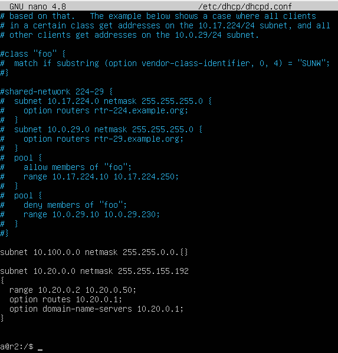
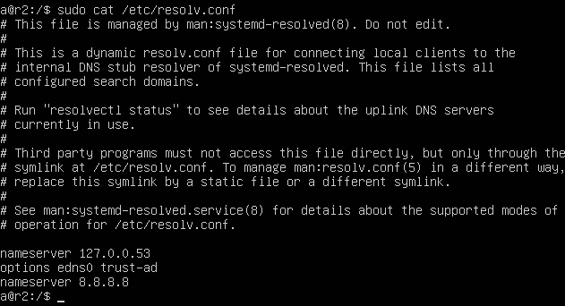
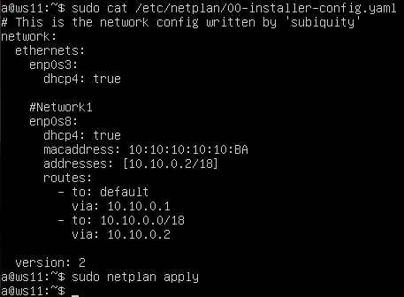
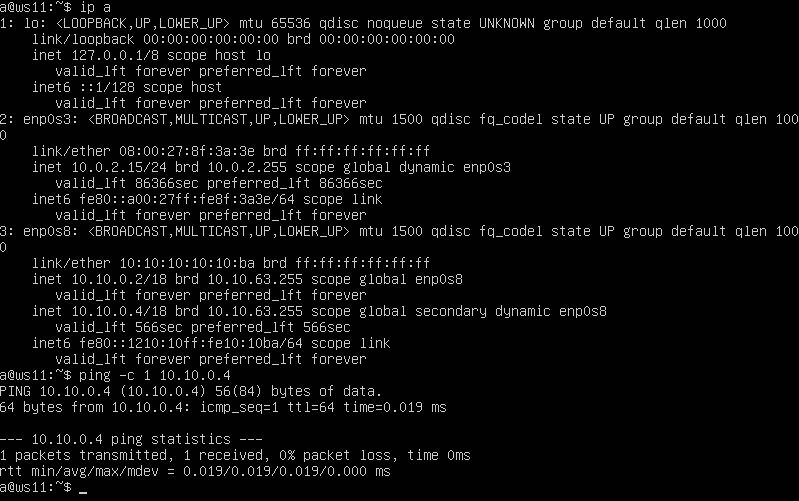
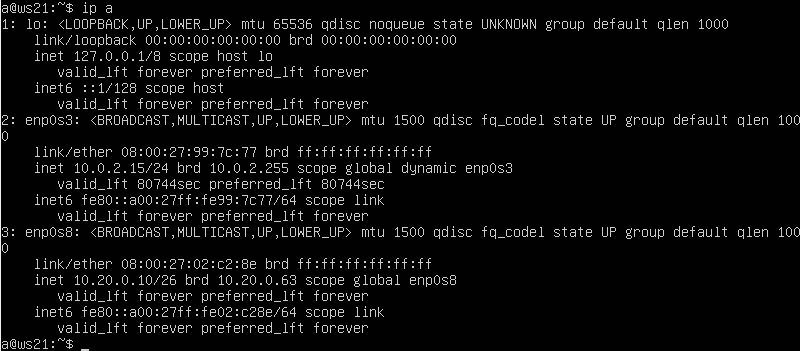
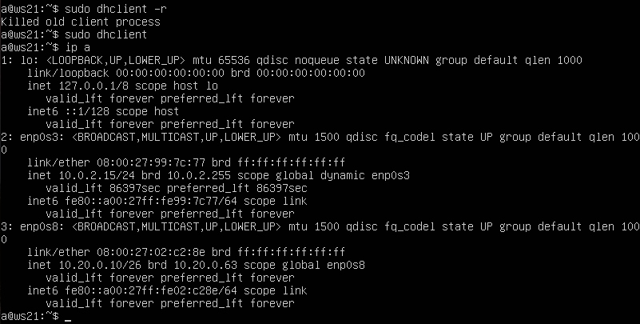

## Part 6. Динамическая настройка IP с помощью DHCP

> [English version](../eng/Part6.md)

`DHCP` (Dynamic Host Configuration Protocol) используется для автоматической выдачи сетевых параметров клиентам: IP-адреса, маски подсети, шлюза по умолчанию и DNS-сервера.

Для выполнения примеров используются виртуальные машины:
- `r1` и `r2` — маршрутизаторы;
- `ws11`, `ws21` и `ws22` — рабочие станции.

Установим DHCP-сервер:

```bash
sudo apt install isc-dhcp-server
```

---

### 6.1. Настройка DHCP-сервера

На `r2` настроим DHCP-сервер в файле `/etc/dhcp/dhcpd.conf`.



Для настройки DNS-сервера добавим строку в файл `/etc/resolv.conf`:

```text
nameserver 8.8.8.8
```



Перезапустим службу:

```bash
sudo systemctl restart isc-dhcp-server
```


Перезагрузим `ws21` и проверим получение адреса по DHCP:

```bash
ip a
```

Также проверим связность с `ws22`.


Подсеть `10.20.0.0/26` настроена как DHCP-пул с диапазоном адресов `10.20.0.2`–`10.20.0.50`.

---

### 6.2. Резервирование адреса по MAC

Настроим для `ws11` фиксированное получение адреса по MAC-адресу.

В файле `/etc/netplan/00-installer-config.yaml` укажем MAC-адрес интерфейса и включим получение адреса по DHCP:

```text
macaddress: 10:10:10:10:10:BA
dhcp4: true
```



После этого выключим виртуальную машину и в настройках VirtualBox укажем тот же MAC-адрес для сетевого адаптера:

```text
Сеть → Адаптер 2 → Дополнительно → MAC-адрес
```

Значение:

```text
1010101010BA
```

Настроим DHCP-сервер на `r1` для выдачи адреса по привязке к MAC-адресу.

Файл `/etc/dhcp/dhcpd.conf`:


Для настройки DNS добавим в `/etc/resolv.conf`:

```text
nameserver 8.8.8.8
```


Перезапустим DHCP-сервер:

```bash
sudo systemctl restart isc-dhcp-server
```


Проверим получение адреса на `ws11` и доступность `ws22`:



---

### 6.3. Обновление DHCP-аренды

На `ws21` и `ws22` включим получение адреса по DHCP через Netplan:

```text
dhcp4: true
```

После изменения конфигурации применим настройки:

```bash
sudo netplan apply
```

Проверим текущий IP-адрес:



Освободим текущую аренду и запросим новый адрес у DHCP-сервера:

```bash
sudo dhclient -r
sudo dhclient
```

После получения новой аренды снова проверим IP-адрес:



---

## Навигация

↑ [README_ru](../../README_ru.md)

← [Part 5. Статическая маршрутизация сети](Part5_ru.md)

→ [Part 7. NAT](Part7_ru.md)

---