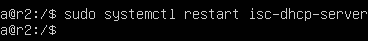
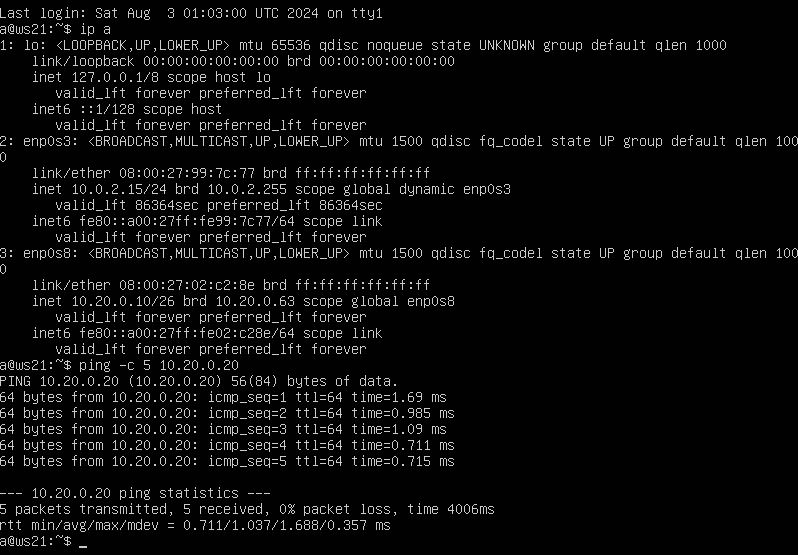
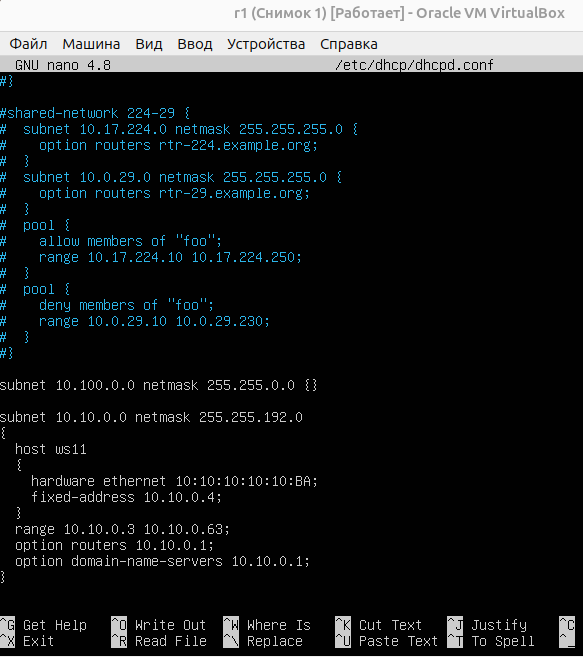
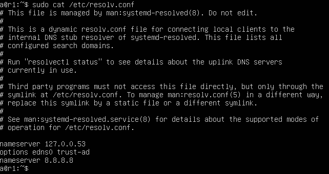
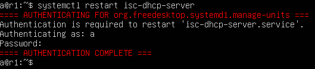

## Навигация

↑ [README_ru](../README_ru.md)

← [Part 5. Статическая маршрутизация сети](../docs/Part5.md)

→ [Part 7. NAT](../docs/Part7.md)

## Part 6. Динамическая настройка IP с помощью DHCP

> **DHCP** (Dynamic Host Configuration Protocol) — это протокол, который автоматически назначает IP-адреса и другие сетевые параметры устройствам в сети. Это упрощает настройку сетевых устройств, так как не нужно вручную настраивать параметры для каждого устройства.
---
В этом задании настроим DHCP сервер на маршрутизаторе r2, пропишем DNS-сервер, настроим выдачу IP-адресов для подсети, а также добавим жесткую привязку IP-адреса к MAC-адресу на маршрутизаторе r1.

**! Главное, не забыть установить службу DHCP с помощью команды `sudo apt install isc-dhcp-server`.**

---

1. Для r2 настроим в файле */etc/dhcp/dhcpd.conf* конфигурацию службы **DHCP**:
   
  - **Редактирование файла */etc/dhcp/dhcpd.conf*:**
  
Открываем файл конфигурации DHCP сервера */etc/dhcp/dhcpd.conf*, и вносим туда указанные в задании изменения:

  **Объяснение изменений:**
    
  - **subnet 10.100.0.0 netmask 255.255.0.0 {}**:
Определяет подсеть 10.100.0.0 с маской сети 255.255.0.0.Поскольку фигурные скобки пусты, для этой подсети нет никаких специальных настроек или конфигураций. Это нужно для указания DHCP серверу, что он не должен раздавать IP-адреса в этой подсети, но он все равно должен знать о ее существовании.

 - **subnet 10.20.0.0 netmask 255.255.255.192 {...}**: 
Определяет подсеть 10.20.0.0 с маской сети 255.255.255.192.
Внутри фигурных скобок находятся конкретные настройки для этой подсети:

    - **range 10.20.0.2 10.20.0.50;**:
  
      - Указывает диапазон IP-адресов, которые DHCP сервер может раздавать клиентам в этой подсети.
      - Адреса будут раздаваться в пределах от 10.20.0.2 до 10.20.0.50 включительно.
       
    - **option routers 10.20.0.1;**:
      - Указывает IP-адрес маршрутизатора по умолчанию для клиентов, получающих IP-адреса в этой подсети.
      - Клиенты будут использовать 10.20.0.1 в качестве шлюза по умолчанию для выхода из своей локальной сети.

    - **option domain-name-servers 10.20.0.1;**:

      - Указывает IP-адрес DNS-сервера для клиентов, получающих IP-адреса в этой подсети.
      - Клиенты будут использовать 10.20.0.1 как DNS-сервер для разрешения имен в IP-адреса.
---

- **Редактирование файла */etc/resolv.conf*:**

Открываем файл */etc/resolv.conf* и добавляем строку `nameserver 8.8.8.8`.

Так мы добавляем IP-адрес DNS-сервера, который система будет использовать для разрешения доменных имен в IP-адреса. `8.8.8.8` — это IP-адрес публичного DNS-сервера, предоставляемого компанией Google.

---

2. Перезагрузим службу **DHCP** (`systemctl restart isc-dhcp-server`) на машине r2.

Теперь перезагрузим  машину ws21, после чего покажем, что она получила адрес (`ip a`) и пропингуем ws22 с ws21.

---

3. Укажем MAC адрес у ws11, для этого в *etc/netplan/00-installer-config.yaml* надо добавить строки: `macaddress: 10:10:10:10:10:BA`, `dhcp4: true`.

Теперь выключим машину ws11 и откроем её настройки в VirtualBox: Сеть -> Адаптер 2 -> Дополнительно, находим строку МАС-адрес и прописываем там `1010101010BA`. Снова запускаем машину.

> **MAC-адрес** (Media Access Control address): Это уникальный идентификатор, присвоенный сетевому интерфейсу для использования в качестве адреса в сетевом уровне модели OSI. Он состоит из 6 байт (48 бит), обычно записанных в шестнадцатеричной системе через двоеточие.

---

4. Теперь настроим r1 аналогично r2, но  выдача адресов будет с жесткой привязкой к MAC-адресу (ws11).

  -  **Настроим в файле */etc/dhcp/dhcpd.conf* конфигурацию службы DHCP**:
    
      
  
  - **Отредактируем файла */etc/resolv.conf*:** Добавляем строку `nameserver 8.8.8.8`

      

  - **Перезагружаем службу DHCP:**

      

  - **Показываем, что ws11 получила адрес и пингуем ws22 с ws11:**

      

---
  
5. Запросим с ws21 обновление ip адреса.

На машинах ws21 и ws22 открываем файл *etc/netplan/00-installer-config.yaml* и прописываем в сети enp0s8 строку `dhcp4: true`. Не забываем применить изменения (`sudo netplan apply`).

Проверим IP-адрес ws21 до обновления:

Удаляем старый IP-адрес командой `sudo dhclient -r` и запрашиваем обновление IP-адреса с помощью команды `sudo dhclient`. После этого снова проверяем IP-адрес.

---

В данном пункте мы пользовались следующими опциями DHCP сервера:
 - Настройки DHCP сервера:
    - Указание диапазона IP-адресов для раздачи в подсети.
    - Указание маршрутизатора по-умолчанию (option routers).
    - Указание DNS-сервера (option domain-name-servers).
    - Настройка статических IP-адресов для определенных устройств (host, hardware ethernet, fixed-address).
  - Перезагрузка DHCP службы:
    - Применение изменений в конфигурации DHCP сервера требует перезагрузки службы.
    - Перезагрузка клиентских устройств (рабочих станций) позволяет им получить новые IP-адреса от DHCP сервера.
  - Привязка IP-адреса к MAC-адресу:
    - Настройка жесткой привязки IP-адреса к MAC-адресу позволяет гарантировать, что определенное устройство всегда получит один и тот же IP-адрес.

---

6. Таинственно сохраним дампы образов всех наших машин.

---
