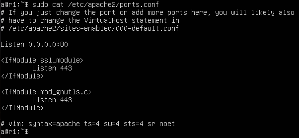
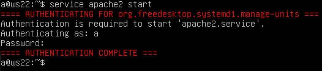
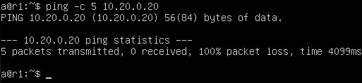
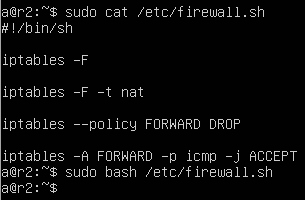
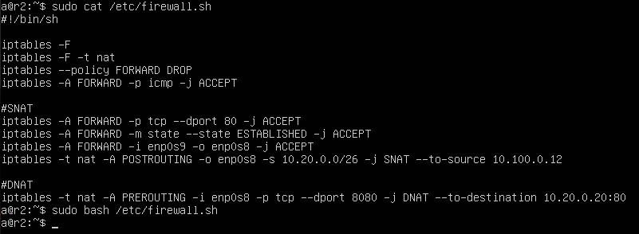

## Part 7. NAT

> [English version](../eng/Part7.md)

`NAT` (Network Address Translation) позволяет изменять IP-адреса и порты пакетов при прохождении через маршрутизатор. В работе используются два варианта: `SNAT` для исходящих соединений и `DNAT` для перенаправления входящих подключений.

Для выполнения примеров используются машины `r1`, `r2` и `ws22`.

На каждую машину установим `Apache`:

```bash
sudo apt install apache2
```

---

### 7.1. Подготовка веб-серверов

На `ws22` и `r1` изменим файл `/etc/apache2/ports.conf`, заменив:

```text
Listen 80
```

на

```text
Listen 0.0.0.0:80
```

`ws22`:


`r1`:



Запустим `Apache`:

```bash
sudo service apache2 start
```

`ws22`:



`r1`:


### 7.2. Базовая фильтрация трафика

На `r2` создадим файл `/etc/firewall.sh` и настроим следующие правила:

- очистка таблицы `filter`;
- очистка таблицы `nat`;
- политика `FORWARD DROP`.


Запустим скрипт:

```bash
sudo chmod +x /etc/firewall.sh
sudo /etc/firewall.sh
```


Проверим доступность `ws22` с `r1`:



После запрета пересылки пакетов узлы перестают обмениваться трафиком.

---

### 7.3. Разрешение ICMP

Добавим правило, разрешающее пересылку ICMP-пакетов.



Перезапустим скрипт и повторим проверку:


После добавления правила ICMP-эхо запросы снова проходят через `r2`.

---

### 7.4. Настройка SNAT и DNAT

Добавим в конфигурацию `r2` правила:

- `SNAT` для сети `10.20.0.0`;
- `DNAT` для перенаправления подключений к порту `8080` на веб-сервер `ws22`.



Проверим работу `SNAT`, подключившись с `ws22` к веб-серверу на `r1`:

```bash
telnet <r1-ip> 80
```

![telnet [адрес] [порт]](../../images/Part7/7.5.2.png)

Проверим работу `DNAT`, подключившись с `r1` к `r2` на порт `8080`:

```bash
telnet <r2-ip> 8080
```

![telnet [адрес] [порт]](../../images/Part7/7.5.3.png)

Подключение успешно перенаправляется на веб-сервер `ws22`.

---

## Навигация

↑ [README_ru](../../README_ru.md)

← [Part 6. Динамическая настройка IP с помощью DHCP](Part6_ru.md)

→ [Part 8. Знакомство с SSH Tunnels](Part8_ru.md)

---