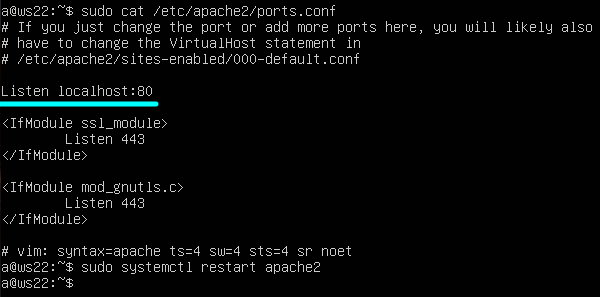
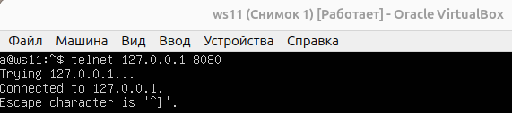
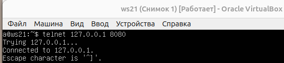

## Part 8. Знакомство с SSH Tunnels

> [English version](../eng/Part8.md)

1. Запустим на r2 фаервол с правилами из Части 7:

2. Запустим веб-сервер Apache на ws22 только на localhost:

В файле /etc/apache2/ports.conf изменим строку `Listen 80` на `Listen localhost:80`, после чего перезапустим сервис apache2.

3. Воспользуемся Local TCP forwarding с ws21 до ws22, чтобы получить доступ к веб-серверу на ws22 с ws21:

(Сначала проверяем на обеих машинах, активен ли ssh-сервер, с помощью команды `sudo systemctl status ssh`)

Как видим, всё получилось, и теперь мы можем управлять машиной ws22 с машины ws21.

`ssh -L 8080:localhost:80 10.20.0.20`:

  - **-L** — устанавливает локальный (Local) TCP-туннель.

  - **8080:localhost:80**:

    - **8080** — порт на локальной машине, который мы используем для подключения.
  
    - **localhost** — указывает, что на удалённом сервере трафик будет направлен на localhost (сам сервер).
  
    - **80** — конечный порт на ws22, на который будут направляться данные.
  
    - **10.20.0.20** — IP-адрес сервера ws22.

4. Воспользуемся Remote TCP forwarding c ws11 до ws22, чтобы получить доступ к веб-серверу на ws22 с ws11:

На машине ws11 тоже сначала проверяем, активен ли ssh-сервер, после чего запустим ту же команду, что и в предыдущем шаге (`ssh -L 8080:localhost:80 10.20.0.20`).

5. Проверим, сработало ли подключение в обоих предыдущих пунктах: 
   
   Перейдём во второй терминал (например, клавишами Alt + F2) и выполним команду `telnet 127.0.0.1 [локальный порт]`

   

   

   > Напоминаю, IP-адрес 127.0.0.1 — это адрес "localhost", который всегда ссылается на сам компьютер, с которого выполняется подключение.

---

## Навигация

↑ [README_ru](../../README_ru.md)

← [Part 7. NAT](Part7_ru.md)

---